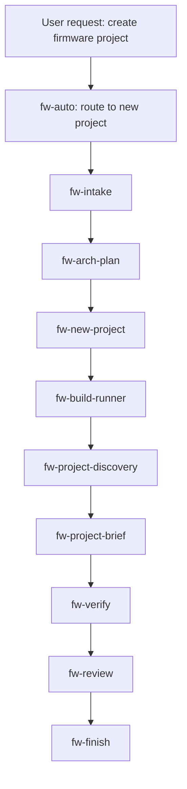
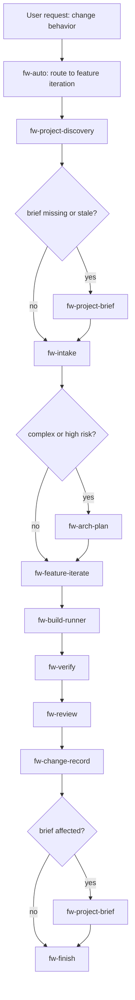
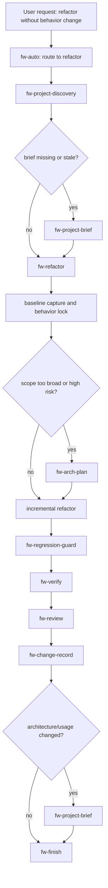
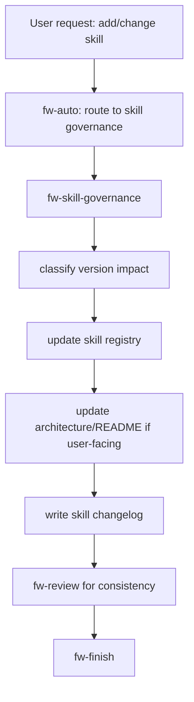

# Firmware Auto-Iteration Skill Architecture

This architecture follows the style of `Jason-chen-coder/dev-skills`:

- One entry-point recommender.
- Many single-purpose skills.
- Loose coupling through artifacts.
- Terminal statuses for recovery.
- Verification gates before claiming completion.
- Skill changes are recorded and versioned like product changes.

## 1. Borrowed Pattern From dev-skills

The useful pattern is not the Git workflow itself. The useful pattern is the workflow system:

- `dev-auto` only recommends the next step. It does not run other skills.
- Each skill does one job.
- Long-lived context is stored in artifacts, not hidden in chat.
- Skills can stop with terminal statuses, then the entry skill can recommend recovery.
- Verification and review are explicit gates, not vibes.

Firmware needs the same shape, with firmware-specific gates:

- Board, MCU, SDK, toolchain, and build system identification.
- Build, flash, simulation, host test, HIL, and manual hardware evidence.
- Config, pinmux, memory, linker, partition, power, timing, protocol, RTOS, and ISR risk checks.
- Project brief generation so the next human or agent can quickly understand the project.
- Skill registry and skill changelog so the skill system itself can evolve safely.

## 2. System Goal

Create a firmware automation skill stack for three independent macro workflows:

1. Create a new firmware project.
2. Iterate functionality in an existing firmware project.
3. Refactor an existing firmware project while preserving behavior.

These workflows must stay isolated:

- New-project flow must not inherit legacy compatibility assumptions.
- Feature-iteration flow must not opportunistically refactor unrelated modules.
- Refactor flow must not silently add features or change behavior.

They can share small tool skills, artifacts, baseline rules, and verification gates.

## 3. Repository Layout

```text
firmware-skills/
  README.md
  AGENTS.md.template
  CHANGELOG.md
  references/
    fw-baseline.md
    why-fw-baseline.md
    artifact-schema.md
    terminal-status.md
    versioning-policy.md
    skill-registry.md
  skills/
    fw-auto/
      SKILL.md
    fw-intake/
      SKILL.md
    fw-project-discovery/
      SKILL.md
    fw-project-brief/
      SKILL.md
    fw-arch-plan/
      SKILL.md
    fw-new-project/
      SKILL.md
    fw-feature-iterate/
      SKILL.md
    fw-refactor/
      SKILL.md
    fw-debug-fix/
      SKILL.md
    fw-verify/
      SKILL.md
    fw-review/
      SKILL.md
    fw-finish/
      SKILL.md
    fw-logbook/
      SKILL.md
    fw-change-record/
      SKILL.md
    fw-build-runner/
      SKILL.md
    fw-skill-governance/
      SKILL.md
```

## 4. Rule Layers

### 4.1 Always-On Rules

File: `AGENTS.md.template`

Keep this short. It should contain only rules every agent must know before using the skills:

- Do not claim firmware work is complete without a change record.
- Do not treat build success as complete firmware validation.
- Do not silently change behavior during refactor.
- Do not ignore board, SDK, toolchain, flash, RTOS, memory, timing, or hardware constraints.
- Do not overwrite user changes.
- Do not add, remove, or materially change a skill without recording the change and version impact.

### 4.2 Firmware Baseline

File: `references/fw-baseline.md`

Recommended baseline:

1. Identify target first: board, MCU, SDK, toolchain, build system.
2. Map before editing: modules, interfaces, configs, tasks, drivers, hardware resources.
3. Leave evidence for execution: command, result, failure, skipped check, reason.
4. Make every change traceable: reason, files, behavior impact, verification result.
5. Keep a project brief current enough for a new human or agent to take over.
6. Record every skill-system change with semantic version impact.

### 4.3 Failure-Mode Rationale

File: `references/why-fw-baseline.md`

Explain what the baseline prevents:

- Wrong board selected while build still passes.
- Pinmux changes breaking another peripheral.
- RTOS priority or ISR changes causing intermittent failures.
- Linker script or partition changes creating boot risk.
- Refactor preserving API shape but changing timing behavior.
- New skill added without documenting how it affects routing.
- Existing skill changed in a way that invalidates old artifacts.

## 5. Artifact Model

Use project-local artifacts:

```text
.codex/artifacts/firmware/
  intake/
    <slug>.md
  plans/
    <slug>.md
  brief/
    project-brief.md
  maps/
    project-map.md
    hardware-map.md
    interface-map.md
  logs/
    session-log.md
  changes/
    <slug>.md
  verification/
    <slug>.md
  reviews/
    <slug>.md
  finish/
    <slug>.md
  skill-system/
    skill-registry.md
    skill-changelog.md
    version-decision-<date-or-slug>.md
```

Artifact rules:

- Macro workflow artifacts describe firmware project work.
- Skill-system artifacts describe changes to the skill stack itself.
- `fw-project-brief` is for handoff. `fw-project-discovery` is for machine-readable project facts.
- `fw-change-record` records firmware project changes.
- `fw-skill-governance` records skill changes.

## 6. Skill List

### 6.1 `fw-auto`

Responsibility:

Entry recommender. It decides the next skill and recovery path. It does not edit code or run commands.

Use when:

- The user does not know the next step.
- The user wants to continue a previous firmware workflow.
- A skill returned a terminal status.
- The request must be classified as new project, feature iteration, refactor, debug, verify, review, finish, brief, or skill-system maintenance.

Output:

```text
Recommended next skill: <skill-name>
Reason: <why>
Read artifacts:
- <paths>
Expected output:
- <paths>
Terminal status recovery:
- <if relevant>
```

### 6.2 `fw-intake`

Responsibility:

Turn unclear firmware requests into structured inputs.

Output:

`.codex/artifacts/firmware/intake/<slug>.md`

Captures:

- Target board and MCU.
- SDK, RTOS, or bare-metal model.
- Peripherals, protocols, and hardware constraints.
- Build, flash, monitor, and debug expectations.
- Behavioral goals and non-goals.
- Risks and open questions.

### 6.3 `fw-project-discovery`

Responsibility:

Inspect an existing firmware project and identify facts needed by other skills.

Output:

- `.codex/artifacts/firmware/maps/project-map.md`
- `.codex/artifacts/firmware/maps/hardware-map.md`
- `.codex/artifacts/firmware/maps/interface-map.md`

Discovers:

- Build system: CMake, Make, West, PlatformIO, ESP-IDF, Zephyr, STM32Cube, vendor SDK.
- Board, target, SDK, and toolchain hints.
- Source layout, tests, CI, configs, flashing/debug scripts.
- Module boundaries, entrypoints, tasks, interrupts, drivers, external interfaces.

### 6.4 `fw-project-brief`

Responsibility:

Generate a readable handoff brief so the next human or agent can quickly understand the project.

Output:

`.codex/artifacts/firmware/brief/project-brief.md`

Include:

- One-sentence project purpose.
- Target device and hardware context.
- Main user/device-facing functions.
- Startup and runtime flow.
- Architecture overview and important modules.
- Build, flash, monitor, and debug commands.
- Configuration entrypoints.
- Test and verification methods.
- Common modification entrypoints.
- Risk areas and unknowns.

Use after:

- First project discovery.
- New project scaffold.
- Major feature completion.
- Refactor that changes architecture or onboarding.

### 6.5 `fw-arch-plan`

Responsibility:

Turn intake and discovery artifacts into an implementation architecture plan.

Output:

`.codex/artifacts/firmware/plans/<slug>.md`

Use for:

- New project architecture.
- Cross-module feature work.
- Risky refactor.
- Hardware, protocol, boot, OTA, storage, or RTOS-sensitive changes.

### 6.6 `fw-new-project`

Responsibility:

Create a firmware project skeleton and establish first architecture artifacts.

Flow:

```text
fw-intake
-> fw-arch-plan
-> scaffold project
-> first boot behavior
-> fw-build-runner
-> fw-project-discovery
-> fw-project-brief
-> fw-verify
-> fw-review
-> fw-finish
```

Terminal statuses:

- `READY_FOR_VERIFY`
- `MISSING_TARGET`
- `TOOLCHAIN_BLOCKED`
- `SCAFFOLD_FAILED`

### 6.7 `fw-feature-iterate`

Responsibility:

Add or modify behavior in an existing firmware project.

Flow:

```text
fw-project-discovery
-> fw-project-brief when missing or stale
-> fw-intake
-> optional fw-arch-plan
-> implement focused change
-> fw-build-runner
-> fw-verify
-> fw-review
-> fw-change-record
-> fw-project-brief if behavior/use/architecture changed
-> fw-finish
```

Hard rules:

- Discover the project before editing.
- Map impact before editing.
- Do not perform unrelated refactor.
- Document skipped hardware checks.

Terminal statuses:

- `READY_FOR_VERIFY`
- `NEEDS_INTAKE`
- `NEEDS_ARCH_PLAN`
- `BUILD_BLOCKED`
- `HARDWARE_BLOCKED`

### 6.8 `fw-refactor`

Responsibility:

Improve structure while preserving behavior.

Flow:

```text
fw-project-discovery
-> fw-project-brief when missing or stale
-> baseline capture
-> behavior lock
-> scope map
-> incremental refactor
-> fw-regression-guard
-> fw-verify
-> fw-review
-> fw-change-record
-> fw-project-brief if architecture changed
-> fw-finish
```

Hard rules:

- Capture baseline before editing.
- Define behavior that must not change.
- Prefer mechanical moves before semantic cleanup.
- If behavior changes, stop and route to `fw-feature-iterate`.

Terminal statuses:

- `READY_FOR_VERIFY`
- `BASELINE_FAILING`
- `BEHAVIOR_CHANGE_DETECTED`
- `SCOPE_TOO_BROAD`
- `NEEDS_ARCH_PLAN`

### 6.9 `fw-debug-fix`

Responsibility:

Use hypothesis-driven debugging for firmware bugs and hardware anomalies.

Flow:

```text
reproduce
-> hypotheses
-> isolate root cause
-> minimal fix
-> regression guard
-> fw-verify
-> fw-review
-> fw-change-record
-> fw-finish
```

Terminal statuses:

- `ROOT_CAUSE_CONFIRMED`
- `BELOW_CONFIDENCE_THRESHOLD`
- `NEEDS_HARDWARE_ACCESS`
- `NEEDS_DESIGN_CHANGE`

### 6.10 `fw-verify`

Responsibility:

Firmware completion evidence gate.

Checks:

- Build.
- Unit, host, simulation, or HIL tests.
- Static analysis if available.
- Config diff.
- Memory, partition, linker, and boot risk.
- Interface/API compatibility.
- Flash, monitor, and manual hardware checks.
- Skipped checks and residual risk.

Output:

`.codex/artifacts/firmware/verification/<slug>.md`

Terminal statuses:

- `READY`
- `NOT_READY`
- `BLOCKED_BY_ENV`
- `BLOCKED_BY_HARDWARE`

### 6.11 `fw-review`

Responsibility:

Firmware-specific review before finish or commit.

Review axes:

- Behavior correctness.
- Hardware resource conflicts.
- Concurrency, ISR, DMA, and RTOS risks.
- Memory, stack, heap, flash, linker, and partition risks.
- Config/build matrix risk.
- Testability and rollback.

Output:

`.codex/artifacts/firmware/reviews/<slug>.md`

Terminal statuses:

- `READY`
- `CHANGES_REQUESTED`
- `NEEDS_VERIFY`

### 6.12 `fw-finish`

Responsibility:

Summarize completion, artifacts, version notes, and residual risk.

Output:

`.codex/artifacts/firmware/finish/<slug>.md`

Include:

- Final status.
- Key changes.
- Verification evidence.
- Residual risk.
- Suggested commit message.
- `Refs:` artifact links.

### 6.13 `fw-logbook`

Responsibility:

Append chronological execution notes.

Output:

`.codex/artifacts/firmware/logs/session-log.md`

Record:

- Workflow name.
- Action.
- Command.
- Finding.
- Blocker.
- Next step.

### 6.14 `fw-change-record`

Responsibility:

Record firmware project changes.

Output:

`.codex/artifacts/firmware/changes/<slug>.md`

Record:

- Changed files.
- Behavior impact.
- Config/hardware impact.
- Verification result.
- Rollback notes.

### 6.15 `fw-build-runner`

Responsibility:

Infer, confirm, and run build commands safely.

Classify failures:

- Toolchain.
- Config.
- Compile.
- Link.
- Generated files.
- Environment.
- Board/target mismatch.

### 6.16 `fw-skill-governance`

Responsibility:

Manage changes to the firmware skill stack itself.

Use when:

- Adding a new skill.
- Removing a skill.
- Renaming a skill.
- Changing a skill trigger.
- Changing a workflow or artifact contract.
- Changing versioning policy.
- Updating README, registry, or baseline rules.

Outputs:

- `.codex/artifacts/firmware/skill-system/skill-changelog.md`
- `.codex/artifacts/firmware/skill-system/version-decision-<slug>.md`
- Updated `references/skill-registry.md`
- Updated `CHANGELOG.md`
- Updated `README.md` when user-facing flow changes

Hard rules:

- Every added skill must have a one-sentence responsibility, trigger, output artifact, and owner workflow.
- Every changed skill must record old behavior, new behavior, affected workflows, and migration notes.
- Every skill-system change must classify semantic version impact.

## 7. Skill-System Versioning

Use semantic versioning for the skill stack.

```text
MAJOR.MINOR.PATCH
```

### 7.1 Major Version

Upgrade major version when a change can break existing usage or artifacts:

- Rename or remove a skill.
- Change a skill's trigger in a way that reroutes existing user requests.
- Change required artifact paths or schemas.
- Change macro workflow order in a way that invalidates previous instructions.
- Make a previously optional gate mandatory.
- Change terminal status meaning.

Example:

Adding a mandatory `fw-project-brief` gate before all existing-project edits may be major if older workflows assumed direct discovery -> implementation.

### 7.2 Minor Version

Upgrade minor version when adding compatible capability:

- Add a new optional skill.
- Add a new supported firmware framework.
- Add a new optional artifact section.
- Add a new verification check that can be skipped with reason.
- Add a new recommended workflow branch without breaking old ones.

Example:

Adding `fw-project-brief` as a recommended handoff artifact is minor if old flows still work and only generate more context.

### 7.3 Patch Version

Upgrade patch version for compatible corrections:

- Fix wording.
- Clarify instructions.
- Fix artifact examples without changing schema.
- Add missing trigger examples.
- Tighten a safety rule without changing routing or required outputs.

Example:

Clarifying that `fw-project-brief` is human-facing while `fw-project-discovery` is machine-facing is patch.

## 8. Skill Change Record Template

Every skill-stack change should create or append an entry:

```md
## <date> - <change title>

Version impact: MAJOR | MINOR | PATCH
Previous version: x.y.z
Next version: x.y.z

Changed skills:
- <skill>: added | removed | renamed | behavior changed | trigger changed

Reason:
- <why this change exists>

Affected workflows:
- new project
- feature iteration
- refactor
- debug/fix
- verify/review/finish

Artifact impact:
- none | optional new artifact | required new artifact | schema change

Migration notes:
- <what a future agent must know>
```

## 9. Macro Workflow Maps

### 9.1 New Project



### 9.2 Existing Project Feature Iteration



### 9.3 Existing Project Refactor



### 9.4 Skill-System Change



## 10. Routing Rules

`fw-auto` only recommends. It does not call skills directly.

Classification:

- No existing project and user wants a firmware scaffold: `fw-new-project`.
- Existing project and user wants behavior change: `fw-feature-iterate`.
- Existing project and user emphasizes behavior preservation: `fw-refactor`.
- User reports bug, failure, or hardware anomaly: `fw-debug-fix`.
- User wants a handoff explanation or onboarding summary: `fw-project-brief`.
- User says done, ready, or asks for evidence: `fw-verify`.
- User prepares to submit: `fw-review`, then `fw-finish`.
- User adds, removes, renames, or changes a skill: `fw-skill-governance`.

## 11. Terminal Status

| Status | Meaning | Recovery |
|---|---|---|
| `READY` | Gate passed | Continue to `fw-finish` |
| `NOT_READY` | Verify/review failed | Return to the relevant implementation skill |
| `NEEDS_INTAKE` | Requirement or constraint unclear | Run `fw-intake` |
| `NEEDS_ARCH_PLAN` | Impact is broad or risky | Run `fw-arch-plan` |
| `BUILD_BLOCKED` | Build failed | Run `fw-build-runner` or fix config |
| `HARDWARE_BLOCKED` | Needs board, probe, device, or instrument | Record skipped checks and manual checklist |
| `BEHAVIOR_CHANGE_DETECTED` | Refactor changed behavior | Stop refactor and route to `fw-feature-iterate` |
| `BELOW_CONFIDENCE_THRESHOLD` | Debug evidence is insufficient | Continue `fw-debug-fix` |
| `SKILL_VERSION_REQUIRED` | Skill-system change lacks version decision | Run `fw-skill-governance` |
| `SKILL_REGISTRY_STALE` | Skill docs and registry disagree | Update registry and changelog |

## 12. Minimum Viable Version

First usable version:

1. `fw-auto`
2. `fw-project-discovery`
3. `fw-project-brief`
4. `fw-intake`
5. `fw-feature-iterate`
6. `fw-verify`
7. `fw-finish`
8. `fw-skill-governance`

Reason:

- Existing-project feature iteration is the most common firmware workflow.
- `fw-project-brief` makes the project handoff-friendly.
- `fw-skill-governance` prevents the skill stack from drifting as more skills are added.

## 13. Next Writing Order

Write these first:

1. `README.md`
2. `references/fw-baseline.md`
3. `references/artifact-schema.md`
4. `references/versioning-policy.md`
5. `references/skill-registry.md`
6. `skills/fw-auto/SKILL.md`
7. `skills/fw-project-discovery/SKILL.md`
8. `skills/fw-project-brief/SKILL.md`
9. `skills/fw-skill-governance/SKILL.md`

Pause point:

Start implementation with `fw-auto/SKILL.md`, then `fw-project-brief/SKILL.md`, because routing and handoff are the backbone of the system.
